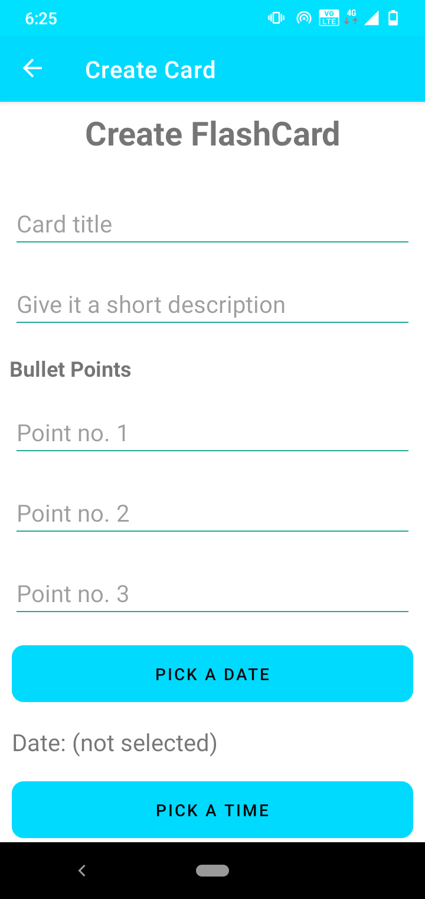
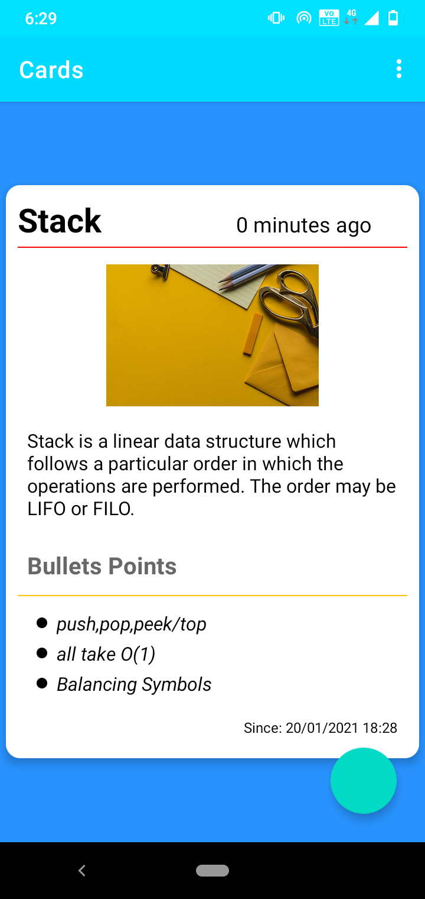
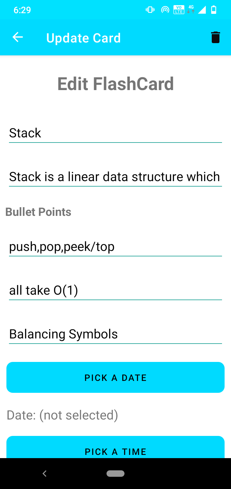
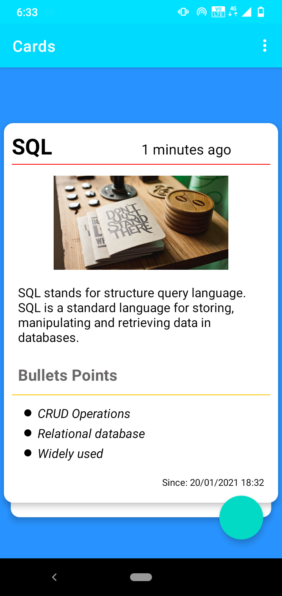

# InnoCards - A Flashcard App
InnoCare is a calorie tracker app that tracks a user’s daily food and calorie intake. It uses Firebase, Kotlin Coroutines, Navigation Drawer, Recycler View and much more.

### Screenshots

